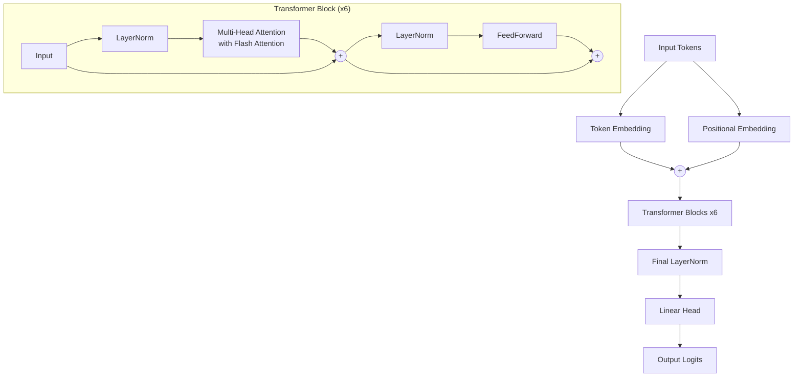

# GPT From Scratch

A fully functional, Decoder-only Transformer language model built entirely from scratch in PyTorch. This project is a foundational implementation designed for learning and experimenting with the core concepts behind models like GPT.

## Features

- **Built from Scratch**: Core components like Multi-Head Attention, FeedForward networks, and Transformer Blocks are implemented natively in PyTorch.
- **Optimized & Scalable**: Features vectorized **Flash Attention** (via PyTorch's native `scaled_dot_product_attention`) and **Mixed-Precision Training** (using `torch.amp`) for massive training speedups and reduced memory overhead.
- **BPE Tokenization**: Uses a custom Byte-Pair Encoding (BPE) tokenizer trained directly on the `tinyshakespeare.txt` dataset using HuggingFace's `tokenizers` library (Vocab Size: 5000).
- **Rotary Positional Embeddings (RoPE)**: Implements RoPE natively to replace standard learned positional embeddings for modern spatial modeling. Configurable via `use_rope` flag.
- **Hardware Agnostic**: Automatically detects and uses Apple MPS (Metal Performance Shaders) or CUDA for GPU acceleration if available, falling back to CPU otherwise.
- **Resumable Training**: The training script automatically detects existing checkpoints and resumes training seamlessly.
- **Advanced Text Generation**: Includes a dedicated script for autoregressive text generation supporting tunable parameters like `--temperature` and `--top_k`.

## Model Architecture & Hyperparameters

The model is a standard Decoder-only Transformer comprising **~10.7M parameters**. Below is the data flow for a single forward pass:



The current configuration (`src/config.py`) is set as follows:

- **Batch Size**: 64
- **Context Window (block_size)**: 256
- **Embedding Dimension (n_embd)**: 256
- **Attention Heads (n_head)**: 8
- **Transformer Blocks (n_layer)**: 6
- **Max Iterations**: 5000
- **Learning Rate**: 3e-4

## Getting Started

### Prerequisites
Make sure you have Python installed along with the required dependencies. You can install the dependencies using:
```bash
pip install -r requirements.txt
```

### Training the Model
To start training the model, simply run:
```bash
python train.py
```
This will:
- Load the dataset and tokenizer.
- Initialize the model or load an existing checkpoint from `checkpoints/gpt_model.pt`.
- Run the training loop, saving checkpoints every 500 steps.
- Plot and save the training loss to `outputs/loss_plot.png`.

### Generating Text
Once you have a trained checkpoint, you can generate text using the CLI interface. It supports temperature and top-k sampling to control the creativity of the output:
```bash
python generate.py --prompt "ROMEO:\n" --max_tokens 500 --temperature 0.8 --top_k 5
```

## Project Structure

- `src/`
  - `tokenizer.py`: BPE tokenizer implementation.
  - `dataset.py`: Data loading and batching logic.
  - `model.py`: Core Transformer architecture (Head, MultiHeadAttention, FeedForward, Block, GPTLanguageModel).
  - `config.py`: Hyperparameters and configuration.
- `train.py`: Main training loop with auto-resume functionality.
- `generate.py`: Inference script for generating text.
- `ablation_study.py`: Script to train and compare standard Positional Embeddings vs RoPE.
- `checkpoints/`: Directory for saving model weights (`gpt_model.pt`).
- `outputs/`: Directory for saving training artifacts (e.g., loss plots).

## Results & Performance

This project tracks model performance through a structured ablation study to quantify the impact of architectural upgrades. Below is the current experimental state:

| Config | Tokenizer | Pos. Embedding | Val Perplexity | Params |
| :--- | :--- | :--- | :--- | :--- |
| **Baseline** | char-level | learned | ~4.39 (Raw) -> ~1.48 (Trained) | ~10.7M |
| **+BPE** | BPE (5000 vocab) | learned | *Training in Progress* | ~7.34M |
| **+BPE+RoPE** | BPE (5000 vocab) | RoPE | *Training in Progress* | ~7.27M |

*(Note: The `eval_suite.py` script is currently running to finalize the BPE and RoPE validation numbers. Parameter counts dropped for BPE due to an intentional reduction in embedding dimension to offset the larger vocab table).*


### Sample Output
Here is an example of the text generated by the model after training, prompted with `"ROMEO:\n"`:
```text
ROMEO:
I would, I were so happy to be thy liege!
But, good my lord, I beseech you, what says he?

BENVOLIO:
He says he will, I pray, sir, be a man
Of such a state as we can find him out.

MERCUTIO:
By my troth, I'll go to him: he is a very noble gentleman,
And a most courteous gentleman.
```

## Roadmap & Future Steps

- [x] Implement Flash Attention for significantly faster training speeds.
- [x] Implement mixed-precision training (torch.amp).
- [x] Switch from a character-level tokenizer to a BPE subword tokenizer.
- [x] Implement Rotary Positional Embeddings (RoPE) and perform ablation study.
- [ ] Train the model on a moderately larger, more diverse dataset (e.g., a few hundred MBs of text) to evaluate generalization and reduce overfitting, measured via validation perplexity.
